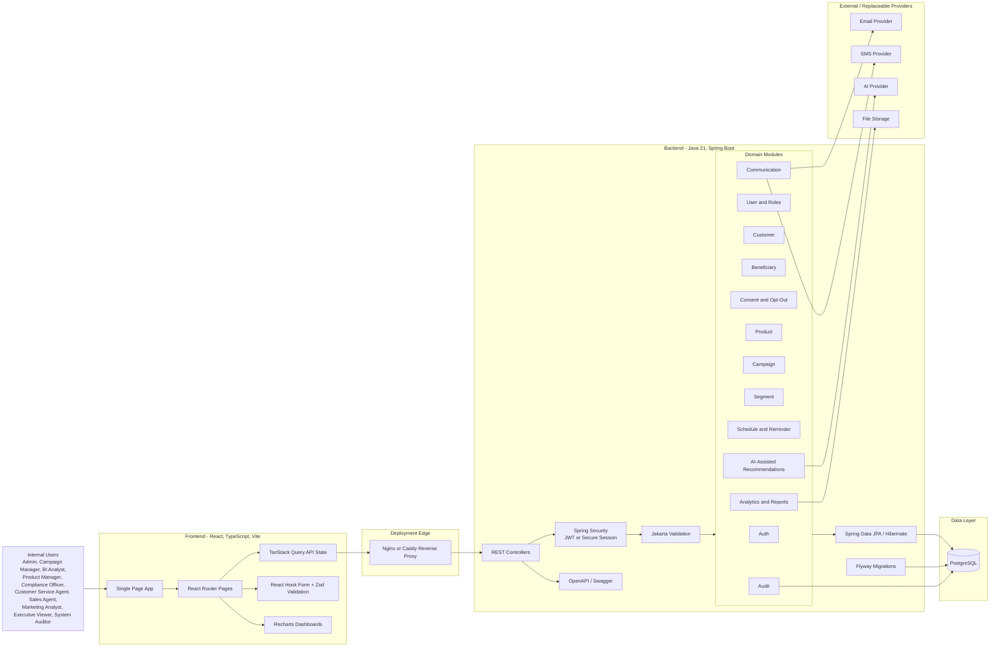

# Initial Architecture Diagram

This diagram captures the first implementation architecture for the Bayer-Westphalian Campaign Management Platform in accordance with the knowledge base.

## Initial Runtime View

- The frontend is a React single-page application served locally by Vite during development and later by a reverse proxy or static container.
- The backend exposes REST JSON APIs, OpenAPI documentation, validation, authorization, and business workflows through Spring Boot.
- PostgreSQL is the system of record for customer, consent, product, campaign, schedule, communication, analytics, report, and audit data.
- Flyway owns all database schema changes so database evolution is version-controlled.
- External email, SMS, AI, and file-storage integrations are replaceable adapters. Mock provider modes are allowed only for development and testing.
- Nginx or Caddy is the planned deployment edge for production routing, HTTPS, and frontend/API traffic separation.

## Quality and Control Boundaries

- Spring Security protects API access for internal users and role-based workflows.
- Consent, campaign eligibility, approval, audit, and customer data rules remain backend-owned.
- Frontend validation improves user experience, but backend validation remains authoritative.
- Audit logging is required for sensitive actions and production evidence.
