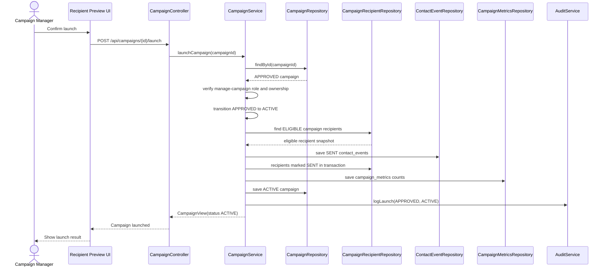

# Campaign Launch Documentation

Campaign launch is the controlled transition that moves an approved campaign into active delivery.
It is separate from recipient preview and is the point where eligible recipients are contacted.

## KB Traceability

| KB / FR | Launch capability |
| --- | --- |
| `FR-060` | Approved campaigns can be launched |
| `BR-005` | Submitted campaigns cannot launch before Compliance Officer approval |
| `BR-032` | Submitted campaign cannot be launched before approval |
| `TC-001` | Launch is blocked unless the campaign status is `APPROVED` |
| `TC-012` | Campaign Manager can launch an approved campaign |
| `TC-013` | Product Manager cannot launch campaigns |
| Sprint 16 **647** | Critical test: *Campaign cannot launch without approval* |
| Sprint 16 **653** | Critical test: *Product Manager cannot launch campaigns* |

### Critical test evidence (item 647)

Automated critical coverage for “campaign cannot launch without approval”:

| Layer | Location |
| --- | --- |
| Backend domain + service | `CampaignCannotLaunchWithoutApprovalTests` (`backend/.../campaign/`) |
| Frontend UI gate catalog | `frontend/src/features/campaigns/campaignCannotLaunchWithoutApproval.ts` |
| Related launch audit / API | `CampaignLaunchCreatesAuditLogTests`, `CampaignControllerTests` (SUBMITTED → blocked) |

Only status `APPROVED` may call `Campaign.launch()` / `CampaignService.launchCampaign`. DRAFT,
SUBMITTED, REJECTED, and post-lifecycle statuses throw a lifecycle business-rule error and do not
persist ACTIVE status, contact events, or LAUNCH audit rows.

### Critical test evidence (item 653)

Automated critical coverage for “Product Manager cannot launch campaigns” (**TC-013**):

| Layer | Location |
| --- | --- |
| Backend critical suite | `ProductManagerCannotLaunchCampaignsTests` |
| Related HTTP security | `ProtectedEndpointSecurityTests#productManagerCannotLaunchCampaign` |
| Frontend catalog | `frontend/src/features/campaigns/productManagerCannotLaunchCampaigns.ts` |
| Expression | `@authz.canManageCampaigns()` → `ADMIN`, `CAMPAIGN_MANAGER` only |
| HTTP filter | `POST /api/campaigns/**` → `SecurityConfiguration.CAMPAIGN_MANAGER_ROLES` |

`PRODUCT_MANAGER` may manage products and read campaigns, but must receive **403 Forbidden** on
`POST /api/campaigns/{id}/launch` and must not see an enabled launch control in the UI.

## Launch Rules

- Launch endpoint: `POST /api/campaigns/{id}/launch`.
- Only campaigns in status `APPROVED` can launch.
- Successful launch changes status from `APPROVED` to `ACTIVE`.
- `CAMPAIGN_MANAGER` and `ADMIN` can launch campaigns when ownership and status rules pass.
- `PRODUCT_MANAGER`, `COMPLIANCE_OFFICER`, `BI_ANALYST`, agents, viewers, and auditors cannot
  launch campaigns.
- Frontend launch buttons are convenience controls only; backend authorization and lifecycle rules
  are authoritative.

## Backend Side Effects

When `CampaignService.launchCampaign` succeeds, it:

1. Verifies the current user can manage campaigns and can access the campaign.
2. Applies the domain launch transition on `Campaign`.
3. Loads stored `ELIGIBLE` rows from `campaign_recipients`.
4. Creates `contact_events` with event type `SENT` for eligible recipients.
5. Marks eligible recipients as `SENT`.
6. Updates `campaign_metrics` with audience size, eligible count, excluded count, and sent count.
7. Saves the campaign as `ACTIVE`.
8. Writes a `LAUNCH` audit log with old status `APPROVED` and new status `ACTIVE`.

Excluded recipients do not create contact events. If there are no eligible recipients, launch can
still activate the campaign, but no contact event rows are written.

## No-Bypass Guarantee

Campaign launch never builds a fresh audience directly from segment criteria. It uses only the
stored recipient snapshot that recipient preview and recipient generation already evaluated.

The eligibility snapshot must preserve these blocking rules before launch:

- Missing or invalid customer consent is excluded as `INVALID_CONSENT`.
- Minor beneficiary rows without guardian consent are excluded as `INVALID_CONSENT`.
- Customer marketing opt-out is excluded as `MARKETING_OPT_OUT`.
- Do-not-contact customers are excluded as `DO_NOT_CONTACT`.
- Duplicate same-campaign customer rows are blocked by the campaign/customer unique constraint and
  duplicate candidates are excluded as `DUPLICATE_CAMPAIGN_RECIPIENT`.
- Monthly contact frequency limits are excluded as `MONTHLY_CONTACT_LIMIT`.
- Campaign lifecycle approval is enforced by the `APPROVED`-only launch transition.

Only rows still marked `ELIGIBLE` can create `SENT` contact events during launch. Excluded rows are
retained for auditability and metrics, but launch must not convert them into contacts.

## Launch Sequence Diagram

## Audit And Metrics Evidence

Launch audit logs use:

- `entityType = campaigns`
- `action = LAUNCH`
- `oldValue.status = APPROVED`
- `newValue.status = ACTIVE`

Launch metrics use the stored recipient snapshot, not criteria-only segment matches. The audience
size is `eligibleCount + excludedCount`, and `sentCount` is the number of contact events created
during launch.

## Related Documentation

- [Campaign Lifecycle Documentation](campaign-lifecycle.md)
- [Recipient Preview Documentation](recipient-preview.md)
- [Campaign Audit Logging Documentation](campaign-audit-logging.md)
